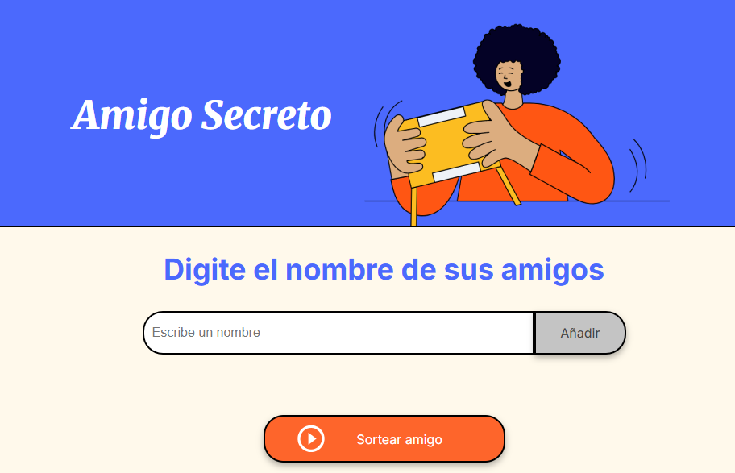

# challenge amigo secreto

# Amigo Secreto

Este proyecto es una aplicación web muy sencilla para sortear un "Amigo Secreto". Es la herramienta perfecta para generar un nombre de forma aleatoria de una lista de amigos y así poder organizar el tradicional intercambio de regalos de manera fácil y sin complicaciones.

Esta aplicación fue creada usando **HTML**, **CSS** y **JavaScript**. Es una solución rápida y amigable para ese momento especial con tus amigos o familia.

## ¿Qué Puedes Hacer Con Esto?

* **Añadir Amigos:** Puedes ingresar y añadir todos los nombres de los participantes que quieras a la lista.
* **Sortear un Nombre:** Con un solo clic, el programa elegirá de forma aleatoria un "amigo secreto" de la lista de nombres que añadiste.
* **Interfaz Amigable:** La aplicación es muy intuitiva y está diseñada para que puedas usarla sin problema, incluso desde tu teléfono o tablet.

## ¿Cómo Usar la Aplicación?

1.  **Empieza la Aplicación:**
    - Simplemente abre el archivo `index.html` en tu navegador web preferido.

2.  **Añadir Nombres:**
    - Escribe el nombre de un amigo en el campo de texto.
    - Haz clic en el botón **"Añadir"**. El nombre aparecerá en la lista debajo.
    - Repite este paso hasta que hayas añadido a todos los participantes.

3.  **Realizar el Sorteo:**
    - Una vez que todos los nombres estén en la lista, haz clic en el botón **"Sortear amigo"**.
    - La aplicación mostrará el nombre del amigo secreto en la parte de abajo.

## Autor del Proyecto

* **Elias Viloria Galvis:** Soy el creador de este proyecto, desarrollado como parte de mi formación en Alura Latam.

